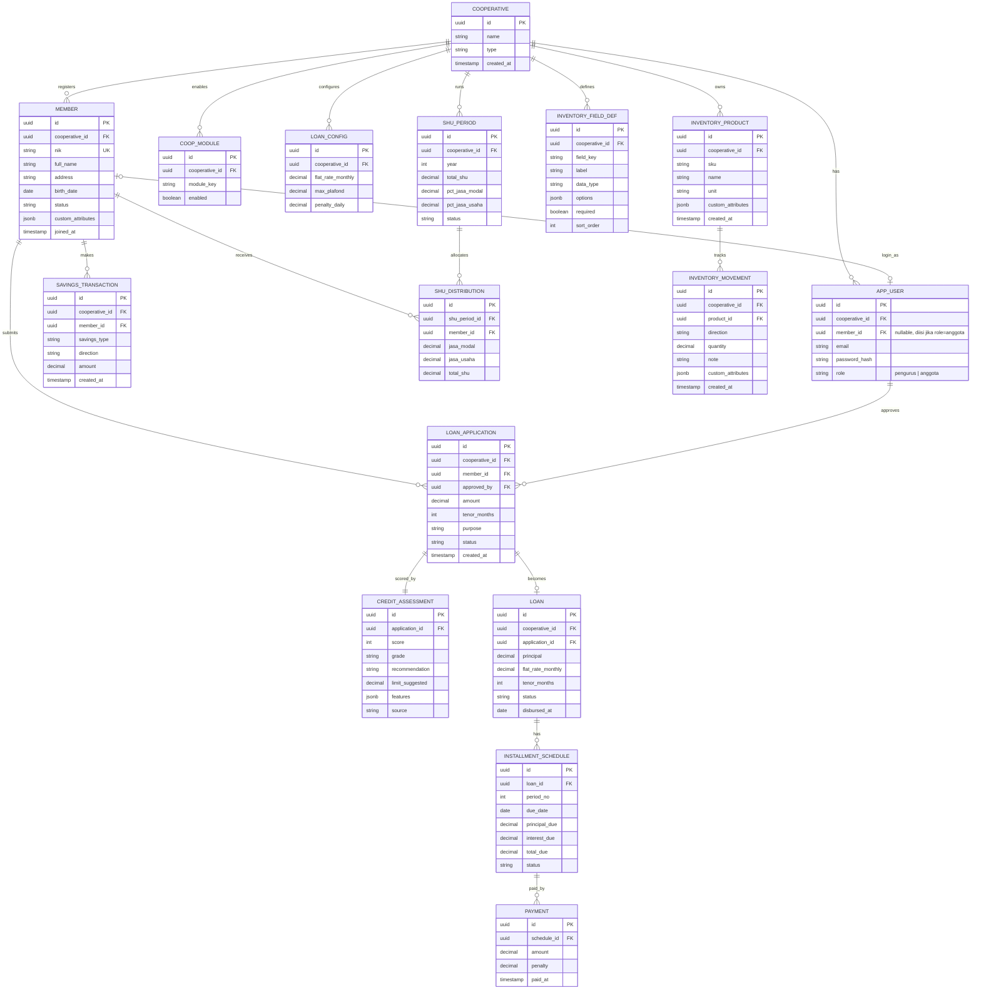

# ERD.md — Wiradana (Digitalisasi Koperasi Simpan Pinjam)

> Skema data untuk hackathon TechnoScape 2026. Turunan dari WIRADANA.md & PLANNING.md.
> Stack: **Go backend + PostgreSQL**. Bunga: **flat**. Scope: tenant-aware (tanpa RLS), insert-only pada transaksi keuangan.

---

## 1. Diagram (Mermaid `erDiagram`)

> Tempel blok di bawah ke editor Mermaid (mis. mermaid.live) atau renderer Markdown yang mendukung Mermaid.

---

## 2. Daftar Entitas & Deskripsi

| Entitas | Peran | Catatan kunci |
|---|---|---|
| `COOPERATIVE` | Tenant (koperasi). | `type` mis. "simpan_pinjam". Semua tabel bisnis menunjuk ke sini. |
| `APP_USER` | Akun login (kredensial). | `role` = `pengurus` / `anggota` (RBAC). `member_id` (nullable FK) terisi jika role=anggota → tautan ke MEMBER. |
| `MEMBER` | Anggota koperasi (data keanggotaan/keuangan). | `nik` unik per koperasi. `custom_attributes` JSONB. Bisa ada tanpa akun login. |
| `SAVINGS_TRANSACTION` | Ledger simpanan (insert-only). | `savings_type` = pokok/wajib/sukarela; `direction` = setor/tarik. **Saldo = SUM, bukan kolom.** |
| `LOAN_CONFIG` | Parameter pinjaman per koperasi. | Suku bunga flat, plafon maks, denda. Bukan hardcode → "konfigurable per tenant". |
| `LOAN_APPLICATION` | Pengajuan pinjaman (Origination). | `status` = pending/approved/rejected; `approved_by` → `APP_USER`. |
| `CREDIT_ASSESSMENT` | Snapshot hasil mock Credit Scoring (1:1 ke aplikasi). | Simpan `features` (JSONB) + `source` untuk jejak keputusan. |
| `LOAN` | Pinjaman aktif (Management). | Terbentuk hanya saat approved. `principal` & rate di-snapshot. |
| `INSTALLMENT_SCHEDULE` | Baris jadwal angsuran (bunga flat). | Di-generate saat approve. `status` per baris. |
| `PAYMENT` | Pembayaran angsuran (Collection, insert-only). | Menunjuk ke baris jadwal; bisa parsial/berulang. |
| `SHU_PERIOD` | Header SHU per tahun. | `pct_jasa_modal` & `pct_jasa_usaha` dari AD/ART (konfigurable). |
| `SHU_DISTRIBUTION` | Hasil SHU per anggota. | `total_shu` = `jasa_modal` + `jasa_usaha`. |
| `COOP_MODULE` | Toggle modul plug-and-play per koperasi. | `module_key` mis. "inventory". Mengontrol sidebar & akses endpoint. |
| `INVENTORY_FIELD_DEF` | Definisi field kustom per koperasi (Dynamic Entity Builder). | Inti modul inventory; lihat `inventory-module.md`. |
| `INVENTORY_PRODUCT` | Master produk/komoditas (modul inventory). | `custom_attributes` JSONB diisi sesuai field def. |
| `INVENTORY_MOVEMENT` | Pergerakan stok (insert-only). | Stok = SUM(masuk) − SUM(keluar). |

---

## 3. Relasi Utama

- `COOPERATIVE` 1—N `APP_USER`, `MEMBER`, `COOP_MODULE`, `LOAN_CONFIG`, `SHU_PERIOD`, `INVENTORY_*` — semua data dimiliki satu koperasi (tenant-aware).
- `MEMBER` 1—N `SAVINGS_TRANSACTION`, `LOAN_APPLICATION`, `SHU_DISTRIBUTION`.
- `MEMBER` (0..1)—(0..1) `APP_USER` — anggota bisa punya akun login (role `anggota`, `member_id` terisi); bisa juga tidak. Pengurus = `APP_USER` tanpa `member_id`.
- `APP_USER` 1—N `LOAN_APPLICATION` (via `approved_by`) — pengurus yang menyetujui.
- `LOAN_APPLICATION` 1—1 `CREDIT_ASSESSMENT` — setiap pengajuan dinilai sekali.
- `LOAN_APPLICATION` 1—(0..1) `LOAN` — pinjaman terbentuk **hanya** jika disetujui.
- `LOAN` 1—N `INSTALLMENT_SCHEDULE` — jadwal angsuran.
- `INSTALLMENT_SCHEDULE` 1—N `PAYMENT` — pembayaran (parsial/berulang).
- `SHU_PERIOD` 1—N `SHU_DISTRIBUTION` — alokasi per anggota.
- `INVENTORY_PRODUCT` 1—N `INVENTORY_MOVEMENT` — pergerakan stok (modul opsional).

---

## 4. Keputusan Desain (rationale untuk Q&A juri)

1. **Tenant-aware tanpa RLS.** Setiap tabel bisnis punya `cooperative_id`; aplikasi filter `WHERE cooperative_id = ?`. RLS Postgres = roadmap, bukan klaim teruji.
2. **Simpanan pakai ledger, bukan kolom saldo.** Saldo = `SUM(amount)` per anggota per jenis. Menegakkan insert-only, menjawab pain "saldo tidak sinkron", audit gratis.
3. **Pinjaman dipecah 4 entitas** mengikuti pola CONFINS (Origination → Management → Collection): `LOAN_APPLICATION` → `LOAN` → `INSTALLMENT_SCHEDULE` → `PAYMENT`.
4. **Credit scoring di-snapshot** (`CREDIT_ASSESSMENT`) agar keputusan terekam dengan `features` + `source` — bisa pertanggungjawabkan kenapa approve/reject.
5. **`LOAN` snapshot `principal` & `flat_rate_monthly`.** Kalau `LOAN_CONFIG` berubah nanti, pinjaman lama tidak ikut berubah (integritas historis).
6. **Pembayaran terpisah dari jadwal.** Satu angsuran bisa dibayar parsial/berulang; bayar = insert `PAYMENT`, lalu hitung ulang `status` baris. Tidak ada UPDATE jumlah uang.
7. **SHU dua tabel.** Alokasi persen konfigurable per periode (AD/ART) di `SHU_PERIOD`; hasil per anggota di `SHU_DISTRIBUTION` (rumus WIRADANA.md §5.2).
8. **`LOAN_CONFIG` memisahkan parameter dari logic.** Bikin rumus defensible: "dikonfigurasi per koperasi sesuai keputusan rapat anggota".
9. **`custom_attributes JSONB`** di `MEMBER` & `INVENTORY_PRODUCT` = fondasi Dynamic Entity Builder (mis. "kadar air") tanpa migrasi.
10. **Dua role: `pengurus` & `anggota`.** `APP_USER` = kredensial, `MEMBER` = data. Tautan via `APP_USER.member_id` (nullable). Anggota hanya akses data dirinya (enforce dari JWT). Detail di `member-portal.md`.
11. **Modul inventory generic & opsional.** `COOP_MODULE` toggle aktif/tidak; `INVENTORY_FIELD_DEF` membuat skema fleksibel per koperasi (bukan hardcode beras). Detail di `inventory-module.md`. Tetap Tier 3 — kerjakan setelah core solid.

---

## 5. Catatan Implementasi

- **PK**: `uuid` (gen di app atau `gen_random_uuid()`). **FK**: `*_id`.
- **Uang**: `decimal/numeric`, jangan float.
- **Enum-like** (`savings_type`, `direction`, `status`, `grade`, `role`) cukup `string` + validasi di app (cepat untuk hackathon); bisa di-`CHECK` constraint kalau sempat.
- **Insert-only**: tidak ada endpoint UPDATE/DELETE pada `SAVINGS_TRANSACTION` & `PAYMENT`. Koreksi via transaksi baru (lawan arah).
- **Index** yang berguna: `MEMBER(cooperative_id, nik)`, `SAVINGS_TRANSACTION(member_id, savings_type)`, `INSTALLMENT_SCHEDULE(loan_id, status)`, `LOAN_APPLICATION(cooperative_id, status)`.
- **Saldo & SHU** dihitung query-time / saat generate laporan, bukan disimpan denormal (kecuali butuh cache nanti).

---

## 6. Entitas di luar scope MVP (roadmap)

- `NOTIFICATION_LOG` — kalau notifikasi WA diangkat dari mock-log jadi entitas tersendiri.
- `AUDIT_EVENT` — bila audit trail eksplisit diaktifkan (saat ini cukup pola insert-only).
- `WITHDRAWAL_REQUEST` — bila pengajuan penarikan sukarela oleh anggota (member-portal §3 poin 8) dibuat formal.

> Modul inventory (`INVENTORY_*`) kini bagian dari skema (modul opsional Tier 3), bukan roadmap lagi — lihat `inventory-module.md`.
